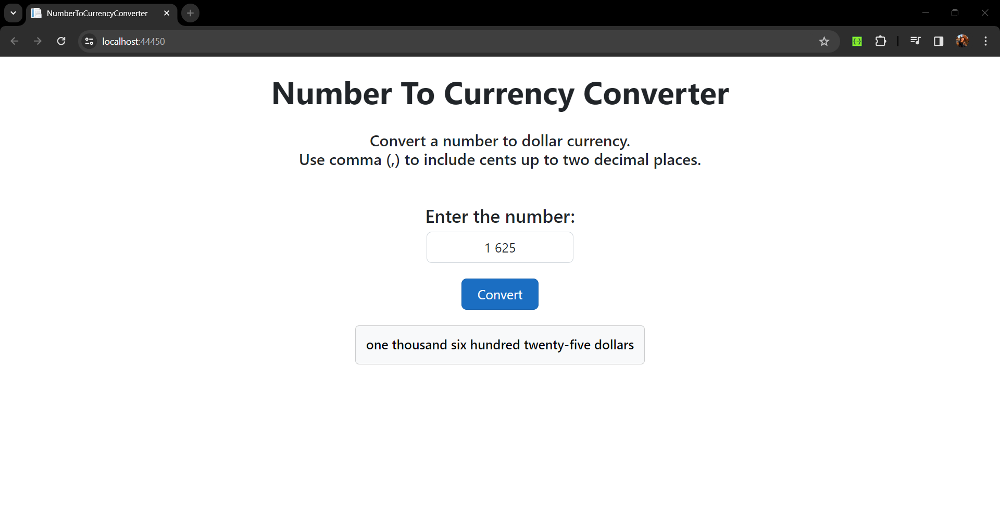
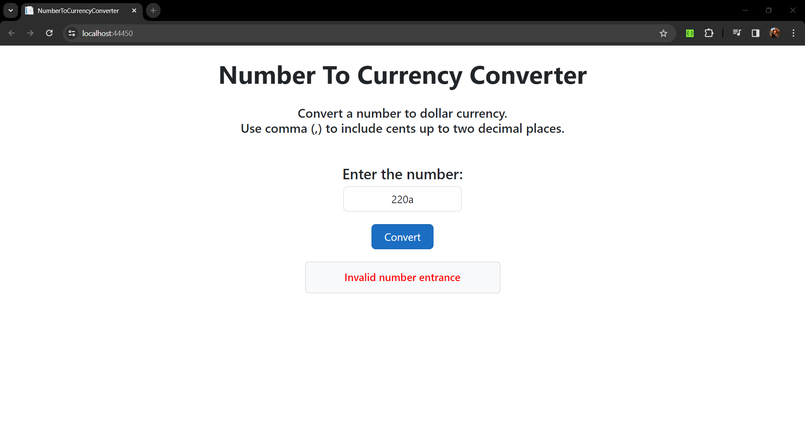
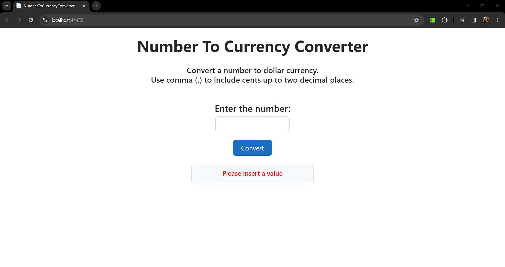

Number To Currency Converter
===

**Requirements**:

- .NET 6.0
- Node.js 20.10.0

Description
---
This is an application which converts a valid number entrance into dollar currency sentence.

This project was developed using React and ASP .NET (C#).

Structure
---

- Project (**NumberToCurrencyConverter**)
    - **ClientApp**
        - Contains the frontend project developed using React
    - **Server**
        - Contains the backend project developed using ASP .NET   
- Test Project (**NumberToCurrencyConverterTest**)
    - Contains the backend unit tests developed using Xunit

How to use
---

1. Insert a number
2. Click on the `Convert` button
3. The application will convert the number into a dollar currency sentence

    3.1. Valid case
    

    3.2. Invalid case
    
    
    3.3. Empty case
    